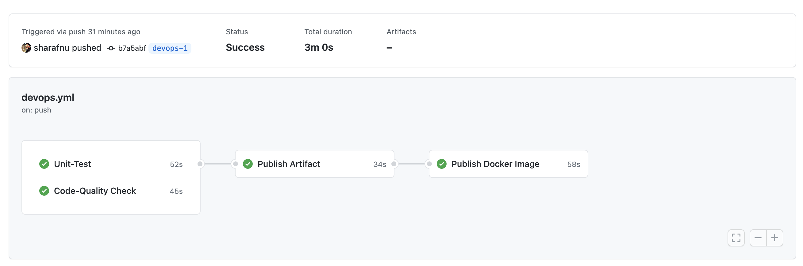
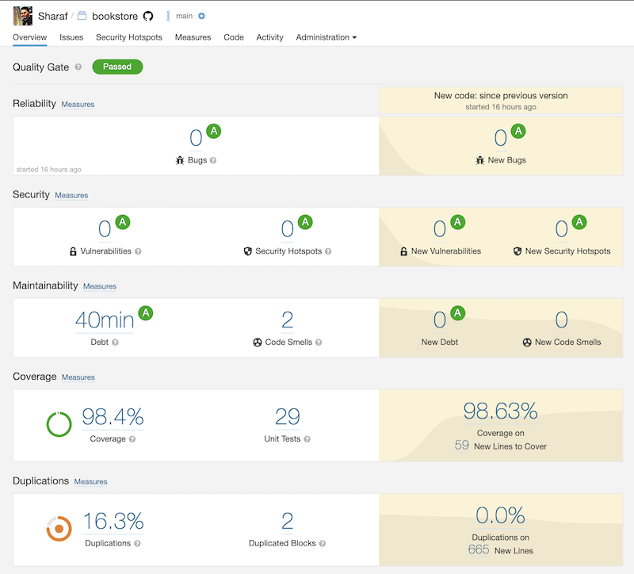

# Book Store API

> Book Store REST API implementation for SmartDubai Assessment. Created REST APIs for CRUD operations on Book resource and additional API for adding books to cart.

## Table of contents
* [Approach](#approach)
* [Setup](#setup)
* [API Specifications](#api-specifications)
* [Build Pipeline](#build-pipeline)
* [Sonar Analysis](#sonar-analysis)

## Approach
Used latest version of SpringBoot and Java 8. For persistence, used default in-memory database. For unit testing, used Junit Jupiter and tried to cover the services layer. Added Mock MVC tests for the controllers and also implemented a simple integration test.

## Setup
Please follow one of the below steps: 

 **Development Setup**

Download or clone the code to local workstation. Import as maven project to Eclipse of IntelliJ. 

>Run `BookstoreApplication` to start the REST API or execute the tests package to check the test results and coverage

**Local Execution using Maven**

Navigate to root directory and execute the below command 

`mvn clean install`

After successful build, navigate to target directory and execute the below command

`java -jar bookstore-0.0.1-SNAPSHOT.jar`

**Running the Docker build**

The latest code is built and pushed to public dockerhub. Please follow the below commands to pull the image and execute

`docker pull sharafnu/boostore-api`

Start the container

`docker run -p 8080:8080 sharafnu/boostore-api`

**Testing the APIs**
Once the endpoint is up, please use the postman collection collection, `bookstore-api.postman_collection.json` available on root directory to validate the APIs
 

The same is also upload here [Postman Collection](https://www.getpostman.com/collections/a6e3b49a39bae0d29b71)

## API Specifications
Followed API first design by implementing Swagger specifications. Please refer the bookstore-swagger.yaml at the root directory. 

Alternatively, the same specifications can be viewed on [SwaggerHub](https://app.swaggerhub.com/apis/sharafnu/bookstore/1.0.0)

## Build Pipeline
Integrated using Github Actions. The below stages are incorporated -
* Unit Tests
* Code Quality Check using SonarCloud
* Publish Artificats to GitHub packages
* Build and publish docker images to public repo

## Sonar Analysis
Integrated the pipeline with SonardCloud as part of CI. 

Latest report can be seen by accessing the below URL

[View SonarCloud Dashboard](https://sonarcloud.io/dashboard?id=sharafnu_bookstore-api)

